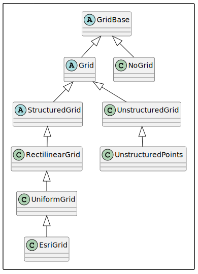
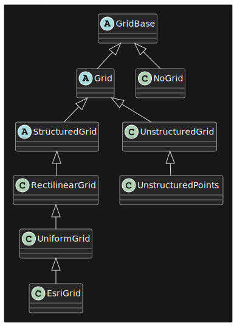

=================
Data and metadata
=================

This chapter explains data and metadata in FINAM.

Data arrays
-----------

Internally, all data is passed as :class:`numpy.ndarray` (or :class:`numpy.ma.MaskedArray`, see `Masked arrays`_), wrapped in :class:`pint.Quantity`.
In addition, a time axis with a single entry is added at index 0.

Data can be pushed to outputs as any type that can be wrapped in :class:`numpy.ndarray`.
This includes lists and scalar values.
Wrapping, adding time axis and units are performed internally, based on the available metadata (see section metadata_).

Inputs always receive data in the wrapped :class:`numpy.ndarray` form, with units and time axis.

Several tool functions are provided in :mod:`.data` to convert to and from the internal data structure:

* :func:`full(value, info) <.data.full>`
  Creates a new data array with units according to the given info, filled with given value.
* :func:`full_like(data, value) <.data.full_like>`
  Creates a new data array with the same shape, type and units as a given object.
* :func:`prepare(data, info, time) <.data.prepare>`
  Wraps data, checks or adds time axis and units based on ``info`` (see `The Info object`_).
  Performs a metadata checks.
* :func:`strip_time(xdata, grid) <.data.strip_time>`
  Squeezes away the time axis if there is a single entry only, and raises an error otherwise.
* :func:`get_magnitude(xdata) <.data.get_magnitude>`
  Extracts data without units. Returns a :class:`numpy.ndarray` array without units, but with time axis preserved.
* :func:`get_units(xdata) <.data.get_units>`
  Gets the :class:`pint.Unit` units of the data
* :func:`get_dimensionality(xdata) <.data.get_dimensionality>`
  Gets the :mod:`pint` dimensionality of the data (like length, mass, ...)
* :func:`has_time_axis(xdata, grid) <.data.has_time_axis>`
  Checks if the data has a time axis

Masked arrays
^^^^^^^^^^^^^

FINAM uses :class:`numpy.ma.MaskedArray` inside :class:`pint.Quantity` to represent masked data.
Masked data does not require any special treatment and can be used like usual numpy arrays.

By default FINAM will allow data to have flexible masks, which means they can change over time.
In the :class:`.Info` object (see below), the mask of the data can be specified:

* :any:`.Mask.FLEX`: data can be masked or unmasked and the mask could change over time (default)
* :any:`.Mask.NONE`: data is unmasked and exchanged as plain numpy arrays
* :class:`numpy.ndarray` or :class:`bool`: data is masked with a given mask that is constant over time

Convenience functions for masked arrays are:

* :func:`is_masked_array <.data.is_masked_array>` to check if the given data is a masked array
* :func:`has_masked_values <.data.has_masked_values>` to check if the given data is a masked array and has some values masked
* :func:`filled <.data.filled>` to create a copy of the data with masked entries filled with a given value, if it is a masked array
* :func:`to_masked <.data.to_masked>` to create a masked version of the data
* :func:`to_masked <.data.to_compressed>` to create a flattened version of the data only containing the unmasked values
* :func:`to_masked <.data.from_compressed>` to create a full mask array from a compressed version of the data
* :func:`to_masked <.data.masks_compatible>` to check if mask settings in info objects are compatiblemasks_equal
* :func:`to_masked <.data.masks_equal>` to check if masks are equal

.. warning::
    Due to a :mod:`numpy` bug, quantities should not be created from masked data using multiplication syntax (i.e. ``magnitude * units``).
    Instead, use method ``Quantity`` of :data:`.UNITS`.

    .. testcode:: create-units-masked
        :hide:

        import finam
        magnitude = 1.0

    .. testcode:: create-units-masked

        data = finam.UNITS.Quantity(magnitude, "m")

    (See issues `pint#633 <https://github.com/hgrecco/pint/issues/633>`_, `numpy#15200 <https://github.com/numpy/numpy/issues/15200>`_)

Metadata
--------

In FINAM, all data is associated with metadata.

Inputs and outputs of components specify the metadata describing the data they send or receive.
Internally, this is used for consistency checks, and for automated data transformations.

FINAM metadata follows the `CF Conventions <https://cfconventions.org/>`_.

There are two types of mandatory metadata:

* `Grid specification`_
* `Units`_ (missing units are assumed as dimensionless)

Metadata is passed around as objects of type :class:`.Info`:

The :class:`.Info` object
^^^^^^^^^^^^^^^^^^^^^^^^^

Objects of type :class:`.Info` represent the metadata associated with an input or output.
It has the following properties:

* ``time`` - initial time stamp for the associated data
* ``grid`` - for the `Grid specification`_
* ``meta`` - a :class:`dict` for all other metadata
* ``mask`` - the mask specification for the data, either :class:`.Mask`, :class:`numpy.ndarray` or :class:`bool`

For convenience, entries in ``meta`` can be used like normal member variables:

.. testsetup:: create-info

    from finam import Info, NoGrid, Mask
    from datetime import datetime

.. testcode:: create-info

    info = Info(
        time=datetime(2000, 1, 1),
        grid=NoGrid(),
        mask=Mask.NONE,
        units="m",
        foo="bar"
    )

    print(info.units)
    print(info.foo)

.. testoutput:: create-info

    m
    bar

When creating inputs or outputs in components, the :class:`.Info` object does not need to be constructed explicitly.
In component code, these two lines are equivalent:

.. testsetup:: create-inputs

    from finam import Component, Info, NoGrid
    from datetime import datetime

    self = Component()

.. testcode:: create-inputs

    time = datetime(2000, 1, 1)
    self.inputs.add(name="A", time=time, grid=NoGrid(), units="m")
    self.inputs.add(name="B", info=Info(time=time, grid=NoGrid(), units="m"))

Metadata from source or target
^^^^^^^^^^^^^^^^^^^^^^^^^^^^^^

Any :class:`.Info` attributes initialized with `None` (default for all entries) will be filled from the metadata on the other end of the coupling link.
E.g. if the grid specification of an input is intended to be taken from the connected output, the input can be initialized like this:

.. testcode:: create-inputs

    self.inputs.add(name="Input_A", time=None, grid=None, units="m")

This works in the same way for outputs to get metadata from connected inputs.

For more details on metadata exchange, see chapter :doc:`./connect_phase`.

Grid specification
^^^^^^^^^^^^^^^^^^

Most of the data exchanged through FINAM will be spatio-temporal be their nature.
FINAM supports different types of structured grids and unstructured grids/meshes,
as well as unstructured point data.

For data that is not on a spatial grid, a placeholder "no-grid" type is provided.

Inputs as well as outputs must specify the grid specification for the data they send and receive, respectively.
We provide regridding adapters to transform between different grids or meshes in an automated way.

Coordinate Reference Systems (CRS) conversions are also covered by the regridding adapters.

Available grid types are:

Non-spatial grids
"""""""""""""""""

:class:`NoGrid(dims) <.NoGrid>`

For data that is not on a spacial grid.
``dims`` specifies the number of dimensions, like 0 for scalars, 1 for 1D arrays, etc.

Spatial grids
"""""""""""""

All spatial grids can have up to 3 dimensions.

:class:`RectilinearGrid(axes=[axis_x, axis_y, axis_z]) <.RectilinearGrid>`

For rectilinear grids, with uneven spacing along some axes.

:class:`UniformGrid(dims=(sx, sy, sz), spacing=(dx, dy, dz), origin=(ox, oy, oz)) <.UniformGrid>`

For uniform rectangular grids, with even spacing along each axis.
A sub-class of :class:`.RectilinearGrid`.

:class:`EsriGrid(nrows, ncols, cellsize, xllcorner, yllcorner) <.EsriGrid>`

For square grids according the ESRI/ASCII grid standard.
A sub-class of :class:`.UniformGrid`.

:class:`UnstructuredGrid(points, cells, celltypes) <.UnstructuredGrid>`

For unstructured grids (or meshes), composed of triangles and/or quads in 2D, and tetrahedrons of hexahedrons in 3D.

:class:`UnstructuredPoints(points) <.UnstructuredPoints>`

For unstructured point-associated data that does not require cells.

Class diagram grids
"""""""""""""""""""

The following figure shows a diagram of grid classes inheritance hierarchy.

.. rst-class:: center

*Figure 1: FINAM grids class diagram.*

Common grid properties
""""""""""""""""""""""

**CRS**: All spatial grid types have a property ``crs`` for the Coordinate Reference Systems.
The property can take any values understood by :mod:`pyproj`.
In many cases, this will just be an EPSG code, like ``crs="EPSG:32632"``

**Order**: All structured grids have an ``order`` attribute for being in either Fortran (``"F"``) or C (``"C"``) order.

**Data location**: For all spatial grids except :class:`.UnstructuredPoints`, data can be associated to either cells or points,
given by the ``data_location`` attribute.

**Axis names**: Grid axes are names according to the ``axes_names`` attribute.

**Axis order**: Regular grids can have inverted axis order (i.e. zyx instead of xyz),
indicated by the ``axes_reversed`` attribute.

**Axis direction**: Axis direction can be inverted, like with descending values for the y axis.
This is indicated by the ``axes_increase`` attribute, which is a tuple of boolean values.

Units
^^^^^

All data in FINAM has units of measurement.
The units can, however, be "dimensionless" for no actual units.

Unit conversions along links between components is done automatically,
based on the metadata provided by the receiving inputs.
So if an input was initialized with ``units="km"``, and data is passed in meters,
the input will internally do the conversion to kilometers.

FINAM uses the :mod:`pint` library for units handling,
and follows the `CF Conventions <https://cfconventions.org/>`_.

For direct access to :mod:`pint` units, the central units registry is exposed by :data:`.UNITS`.

Metadata flow
-------------

For details on how metadata is provided, and how it is passed around during coupling,
see chapter :doc:`./connect_phase`.

Composition metadata
--------------------

Besides metadata for data exchange, FINAM provides functionality to access metadata that describes a given :class:`.Composition` and corresponding simulation.
Users can call :attr:`.Composition.metadata` to retrieve a nested `dict` of all metadata.
This encompasses general metadata like the simulation time frame, as well as metadata for individual components and adapters and the coupling links.

:class:`.Component` as well as :class:`.Adapter` provide default implementations of :attr:`.Component.metadata` and :attr:`.Adapter.metadata`, respectively.
Developers can overwrite these properties to add their own specific metadata. For examples, see the API docs for :attr:`.Component.metadata` and :attr:`.Adapter.metadata`.
