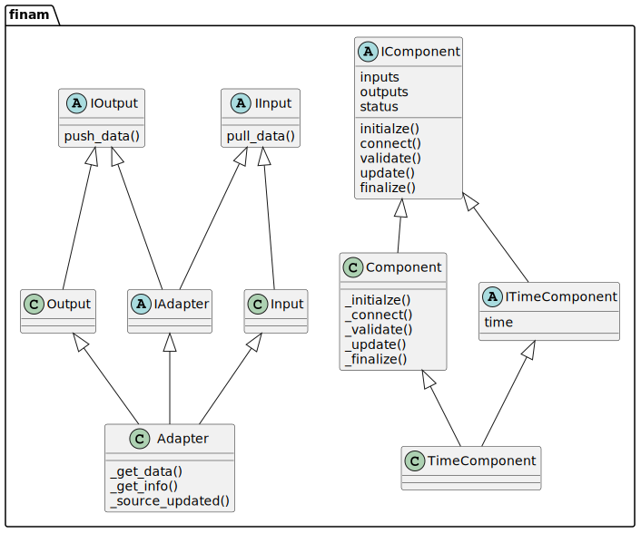
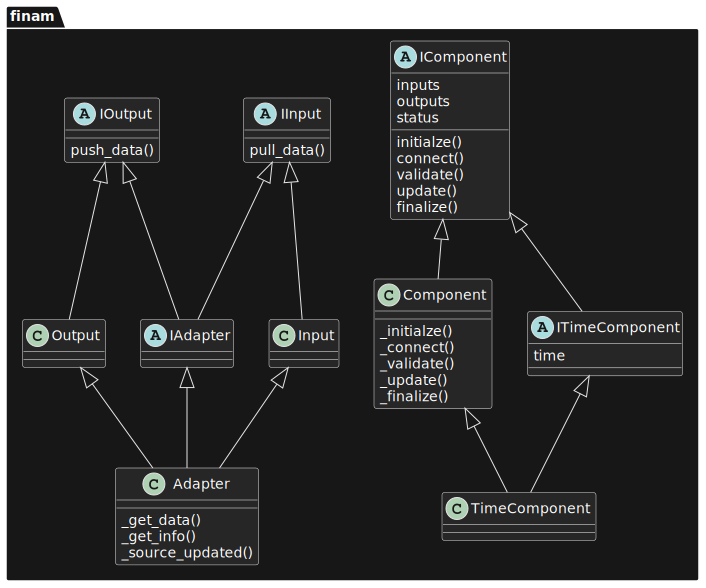

==========
Interfaces
==========

FINAM is primarily a collection of interfaces that allows different models and other components to communicate.

For all interfaces, FINAM also provides abstract or concrete implementations to speed up component development.

Class diagram
-------------

The following figure shows a diagram of FINAM's core interfaces and classes.
Arrows indicate inheritance.
The properties and methods are those typically used or implemented by developers.

.. rst-class:: center

*Figure 1: FINAM interfaces class diagram.*

Components
----------

Components represent linkable entities like models.
There are two interfaces for components: :class:`.IComponent` and :class:`.ITimeComponent`.

:class:`.IComponent`
^^^^^^^^^^^^^^^^^^^^

:class:`.IComponent` serves for pull-based components without an explicit time step.
It provides all the basic methods required for component communication and execution.

* :meth:`.IComponent.initialize` sets up the component
* :meth:`.IComponent.connect` pushes initial values to output slots
* :meth:`.IComponent.validate` checks the component for validity
* :meth:`.IComponent.update` makes a calculation step
* :meth:`.IComponent.finalize` shuts down the component

These methods are called by the scheduler in the given order (and repeatedly for :meth:`.IComponent.update`),
each for all components, before proceeding to the next method.

To access a component's input and output slots, there are the properties:

* :attr:`.IComponent.inputs` returns a `dict-like` of :class:`.IInput` slots by name
* :attr:`.IComponent.outputs` returns a `dict-like` of :class:`.IOutput` slots by name
* :attr:`.IComponent.status` returns the component's current :class:`.ComponentStatus` (``CREATED``, ``INITIALIZED``, ...)

The abstract class :class:`.Component` provides a basic implementation for :class:`.IComponent`.
Classes extending :class:`.Component` must override methods named of the first block, with underscore, like :meth:`.Component._initialize`.
:attr:`.Component.inputs`, :attr:`.Component.outputs` and :attr:`.Component.status` are provided as basic implementations.

:class:`.ITimeComponent`
^^^^^^^^^^^^^^^^^^^^^^^^^^^^

:class:`.ITimeComponent` extends :class:`.IComponent` and serves for components with explicit time step, like simulation models.
In addition to :class:`.IComponent`, it adds one property:

* :attr:`.ITimeComponent.time` should report the component's current time, as a `datetime` object

As :class:`.ITimeComponent` extends :class:`.IComponent`, only :class:`.ITimeComponent` needs to be implemented.

The abstract class :class:`.TimeComponent` provides a basic implementation for :class:`.ITimeComponent`.
It is basically identical to :class:`.Component`, and in addition provides a basic implementation for :attr:`.TimeComponent.time`.

Inputs and Outputs
------------------

Interfaces :class:`.IInput` and :class:`.IOutput` define coupling slots.

The classes :class:`.Input` and :class:`.Output` are provided as implementations for :class:`.IInput` and :class:`.IOutput`, respectively.
They should suffice most use cases.

:class:`.IInput`
^^^^^^^^^^^^^^^^

:class:`.IInput` represents a data exchange input slot, with the following methods:

* :meth:`.IInput.set_source` sets an :class:`.IOutput` as source for this input
* :meth:`.IInput.get_source` returns the :class:`.IOutput` that is the source for this input
* :meth:`.IInput.source_updated` informs the input that the connected :class:`.IOutput` has new data available
* :meth:`.IInput.pull_data` retrieves and returns the connected :class:`.IOutput`'s data

Components usually only use :meth:`.IInput.pull_data` in their :meth:`.Component._update` method.
All other methods are only used under the hood.

All these methods are implemented in :class:`.Input`, so there is normally no need to write an own implementation for :class:`.IInput`.

Another implementation is provided by :class:`.CallbackInput`, for use in push-based components without a time step.
They can connect to :meth:`.IInput.source_updated` by providing a callback function.

Other classes derived from :class:`.Input` can overwrite the method :meth:`.Input.source_updated`.

:class:`.IOutput`
^^^^^^^^^^^^^^^^^

:class:`.IOutput` represents a data exchange output slot, with the following methods:

* :meth:`.IOutput.add_target` adds an :class:`.IInput` as target for this output
* :meth:`.IOutput.get_targets` returns the list of :class:`.IInput` targets of this output
* :meth:`.IOutput.push_data` is used to populate the output with data after an update
* :meth:`.IOutput.notify_targets` informs coupled :class:`.IInput` that new data is available
* :meth:`.IOutput.get_data` returns the data in this output
* :meth:`.IOutput.chain` connects this output to an :class:`.IInput` (or an adapter)

Components usually only use :meth:`.IOutput.push_data` in their :meth:`.Component._update` method.
During coupling setups, :meth:`.IOutput.chain` or it's synonym operator :meth:`>> <.IOutput.__rshift__>` are used.
All other methods are only used under the hood.

All these methods are implemented in :class:`.Output`, so there is normally no need to write an own implementation for :class:`.IOutput`.

Other classes derived from :class:`.Output` can overwrite the method :meth:`.Output.get_data`.

Adapters
--------

Adapters serve for data transformations between outputs and inputs of different components.

:class:`.IAdapter`
^^^^^^^^^^^^^^^^^^^^^^

The interface :class:`.IAdapter` serves for implementing adapters.
It simply combines :class:`.IInput` and :class:`.IOutput`, so it is both at the same time.
:class:`.IAdapter` provides all the methods of :class:`.IInput` and :class:`.IOutput`, but most of them are only used under the hood.

Classes implementing :class:`.IAdapter` can extend :class:`.Adapter`, which provides default implementations for :class:`.IInput` and :class:`.IOutput` methods.

Time-independent/one-shot adapters need to override :meth:`.Adapter._get_data`.
Inside this method, they get their input via `self.pull_data(time)`, transform it, and return the result.

Time-aware adapters, e.g. for temporal interpolation, usually override :meth:`.Adapter._source_updated` and :meth:`.Adapter._get_data`.
In :meth:`.Adapter._source_updated`, incoming data is collected (and potentially aggregated), while in :meth:`.Adapter._get_data` the result is returned.

For details, see chapter :doc:`./adapters`.

:class:`.NoBranchAdapter`
^^^^^^^^^^^^^^^^^^^^^^^^^

Some time-aware adapters may not allow for branching in the subsequent adapter chain.
I.e. they do not support multiple target components.
For these cases, :class:`.NoBranchAdapter` is provided as a marker interface without any methods.
