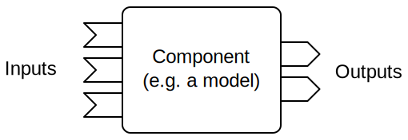
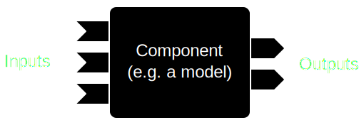

=======================
Components and Adapters
=======================

Models are wrapped according to the interfaces into independent *Components*.
Communication works over so-called *Adapters* that are plugged between models or other components.
These adapters are responsible for transforming data between one model's output and the receiving model's expected input.
Examples are spatio-temporal rescaling or coordinate transforms.

FINAM enables setting up a consistent and flexible data stream workflow involving models and drivers, as well as data pre- and post-processing (e.g. visualization).

Components
----------

Components are the primary entities that are coupled in FINAM.

A component can have multiple inputs and outputs to exchange data with other components.

.. rst-class:: center

*Figure 1: A FINAM component*

There are two principle types of components:

**Components with a time step** are executed when all their inputs are available, according to chapter :doc:`coupling_scheduling`.
Typically, these components represent simulation models.

**Components without time step** can work in a push-based or pull-based manner.
They are executed each time new data becomes available to an input, or when a pull of their outputs is attempted, respectively.
Typical examples are statistical models or file I/O components.

For a list of available components, see chapter :doc:`../usage/known_modules`.

See chapter :doc:`../development/components` for how to implement components.

Adapters
--------

Adapters serve for data transformations between coupled components.
Thus, components are not required to have their inputs and outputs in the same grid specification, CRS, etc. as other, potentially coupled components.

An adapter has one input and one output.

.. rst-class:: center

*Figure 2: A FINAM adapter*

Adapters manage tasks like:

* Spatial up-/downscaling
* Geographic re-projections
* Temporal interpolation and integration
* ...

For a list of available adapters, see chapter :doc:`../usage/known_modules`.

See chapter :doc:`../development/adapters` for how to implement adapters.
