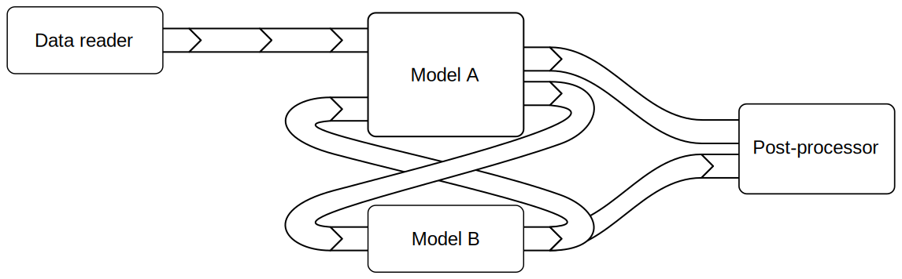
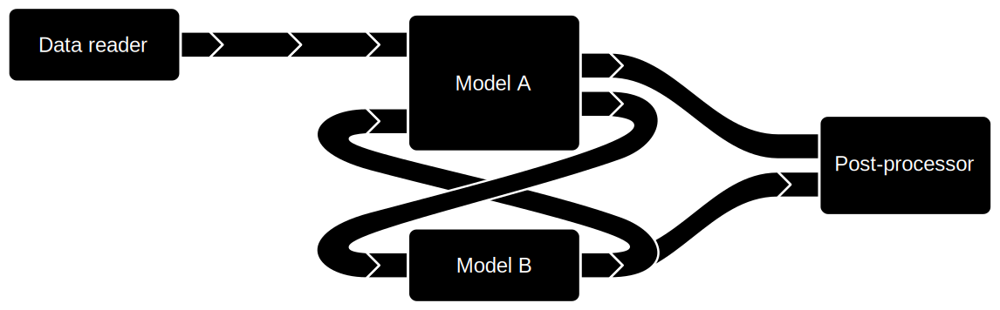
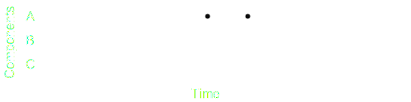

=======================
Coupling and scheduling
=======================

Coupling
--------

A coupling setup in FINAM is a (potentially cyclic) graph of connected components and adapters.
Figure 1 shows an example.

.. rst-class:: center

*Figure 1: A FINAM coupling*

See chapter :doc:`../usage/coupling_scripts` for how to set up coupled models.

The figure illustrates a few important aspects of coupling:

* Cyclic/bi-directional linkage is possible
* Adapters can be chained
* Components can be linked directly when no adapter is required

Scheduling
----------

The scheduling of components follows a simple algorithm that allows for arbitrary, and even variable component time steps.

The algorithm selects the component most back in time, and recursively analyzes its dependencies.
It then updates upstream components before advancing downstream components.
This way, components can rely on data that is not outdated.

The algorithm in detail:

* At each iteration, the component most back in time is selected as the *active component*.
* It is checked whether the *active component* has any upstream components that are not yet at the time of it's next pull.
* If there is any such upstream component component, it becomes the *active component*, and the check is repeated.
* If there is no such upstream component component, the *active component* is updated once.

This way, it is guaranteed that each components has the data for it's next pull available when updated.

The example in Figure 2 illustrates the approach.

.. rst-class:: center

*Figure 2: FINAM scheduling (see text)*

Figure 2 a-d) shows snapshots of a simulation featuring three components A, B and C with different time steps.
Component A depends on B, and B depends on C.
Solid lines and dots denote already simulated model steps.
The right-most solid dot of each component shows it's current simulation time.
Dashed lines and hollow dots show the predicted next pull time of a component.
The box denotes the *active component*.

If Figure 2 a), A is selected as the *active component* because it is most back in time.
It's next pull time is determined, denoted by the hollow dot.
A depends on B, which it not yet at A's next time, and thus becomes the *active component*.

If Figure 2 b), B is the *active component*.
It's next pull time is determined, again denoted by the hollow dot.
B depends on C, which it not yet at B's next time, and thus becomes the *active component*.

If Figure 2 c), C is the *active component*.
It has no dependencies, and can thus be updated.
Steps a) to c) are repeated until C catches up with B's next time.

If Figure 2 d), all dependencies of B (i.e. C) have sufficiently advanced in time for B to update.

As illustrated by the curly braces, it is guaranteed that input data for B is available.
Any kind of interpolation between adjacent source component time steps can be applied to derive the input date.
This is one responsibility of adapters.

Particularly for components with large time steps, it is also possible to integrate over multiple source component time steps.
E.g., component B could use the weighted average of the several steps B has performed since B's last updates.

The update scheme explained so far only forks if there are no cycles in the dependencies.
In the case of circular or bi-directional coupling, one of the involved components must use data that is extrapolated in time.
FINAM provides a dedicated adapter for the purpose of breaking circular dependencies through temporal extrapolation.

Initialization
--------------

During the initialization process, components populate their inputs and outputs with metadata like expected units and grid specifications.
Further, components must push initial values into all outputs.

Due to an iterative initialization approach, components can already exchange data and metadata during that phase.
However, after each connection attempt, components need to signal via their :attr:`.IComponent.status` whether they are done with pulling, pulled nothing, or pulled something but are not done yet.

Unresolvable circular dependencies are detected and reported by the scheduler.

See chapter :doc:`../development/connect_phase` for details and examples.
