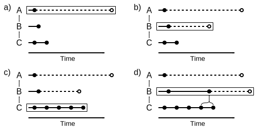
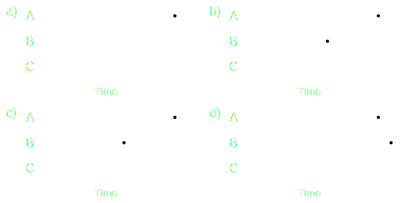

=======================
Coupling and Scheduling
=======================

Coupling
--------

A coupling setup in FINAM is a (potentially cyclic) graph of connected components and adapters.
Figure 3 shows an example.

.. image:: ../images/coupling.svg
    :alt: Finam scheduling
    :align: center
    :class: only-light

.. image:: ../images/coupling-dark.svg
    :alt: Finam scheduling
    :align: center
    :class: only-dark

.. rst-class:: center

*Figure 1: A FINAM coupling*

See chapter :doc:`../usage/coupling_scripts` for how to set up coupled models.

The figure illustrates a few important aspects of coupling:

* Cyclic/bi-directional linkage is possible
* Adapters can be chained
* Components can be linked directly when no adapter is required

Scheduling
----------

The scheduling of components follows a simple algorithm that allows for arbitrary, and even variable, model/component time steps.

It is simply the component most back in time that is updated next.
This way, it is guaranteed that all required input data is available in the outputs of the other components.

The example in Figure 4 illustrates the approach.

.. rst-class:: center

*Figure 2: FINAM scheduling (see text)*

Figure 4 shows a snapshot of a simulation featuring three components A, B and C with different time steps.
Solid lines and dots denote already simulated model steps, and the right-most solid dot of each component shows it's current simulation time.

According to the above rule, component A is most back in time and needs to be updated.
After the update (dashed line and first hollow dot), component A is still on turn.
After the second update of A (dotted line and second hollow dot), it has caught up with B.
Then, B would be updated.

As illustrated by the curly braces, it is guaranteed that input data for A is available on the first update.
Any kind of interpolation between adjacent source component time steps can be applied to derive the input date.
This is one responsibility of adapters.

Particularly for components with large time steps, it is also possible to integrate over multiple source component time steps.
E.g., component C could use the weighted average of the several steps A would have performed when C updates the next time.

Finally, the illustration shows that:
* Time steps for a component do not need to be fixed
* It is not necessary to know the next step size in advance; components only need to be able to report their current simulation time

Initialization
--------------

During the initialization process, components populate their inputs and outputs with metadata like expected units and grid specifications.
Further, components must push initial values into all outputs.

Due to an iterative initialization approach, components can already exchange data and metadata during that phase.
However, after each connection attempt, components need to signal via their :attr:`.IComponent.status` whether they are done with pulling, pulled nothing, or pulled something but are not done yet.

Unresolvable circular dependencies are detected and reported by the scheduler.

See chapter :doc:`../development/connect_phase` for details and examples.
