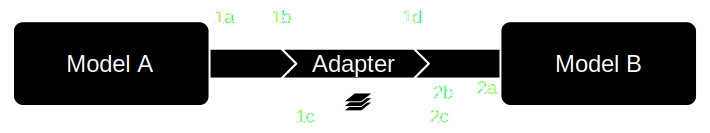

==================
Data flow paradigm
==================

FINAM is based on a **hybrid push-pull information flow**.
Components and adapters "push" data updates to their outputs.
These store the data, and notify all connected inputs and adapters (targets) that new data is available,
but without passing the data itself.
Adapters forward these notifications, until the input of another component is reached.

Simple coupling
---------------

Figure 1 shows the notification and data flow for two directly linked components.

.. rst-class:: center

*Figure 1: Simple data flow. Solid: data, dashed: notifications/pulls.*

The sequence of events is the following:

    | 1. Model A updates
    |    1a -- component pushes data to outputs
    |    1b -- outputs forwards notification (w/o effect)
    | 2. Model B updates
    |    2a -- component pulls data from input
    |    2b -- input pulls from connected output
    |    2c -- data is returned to component

Coupling with adapter
---------------------

With adapters inserted between the components, the procedure is similar.
Adapters just forward the notifications, and transform the data when pulled.
Figure 2 shows the notification and data flow for two components linked via an adapter.

.. rst-class:: center

*Figure 2: Simple data flow with adapter. Solid: data, dashed: notifications/pulls.*

The sequence of events is the following:

    | 1. Model A updates
    |    1a -- component pushes data to outputs
    |    1b -- outputs forwards notification
    |    1c -- adapter forwards notification (w/o effect)
    | 2. Model B updates
    |    2a -- component pulls data from input
    |    2b -- input pulls from connected adapter
    |    2c -- adapter pulls from connected output
    |    2d -- adapter transforms data
    |    2e -- transformed data is returned to component

Components with time steps are **updated by the driver**, while components without time steps **can update when notified**
about new data. They are then free to pull data from their inputs.
In the most basic case, this pull propagates backwards through the chain of adapters until a component's output is reached,
where the latest available data was stored during the push. Adapters handle the data sequentially, and the pulled input
returns the transformed data for usage in the component.

The scheduling of the driver ensures that the requested data is always available.

Coupling with push-pull adapter
-------------------------------

There is one category of adapters that requires a strategy different from the one described above:
adapters for **temporal interpolation, aggregation, etc**.
Such time-dependent adapters need to transform data from multiple points in time
to data for one particular requested point in time.
For that sake, these adapters do not simply execute their operations during pull.
When notified about new input data that became available, the adapter pulls that data and stores it internally.

When data is pulled from downstream of the adapter, it does its calculations
(e.g. temporal interpolation for the requested point in time) and returns the result.
This is illustrated in Figure 3.

.. image:: ../images/data-flow-adapter-push.svg
    :alt: Push-based data flow with adapter
    :align: center
    :class: only-light

.. rst-class:: center

*Figure 3: Push-based data flow with adapter. Solid: data, dashed: notifications/pulls.*

The sequence of events is the following:

    | 1. Model A updates
    |    1a -- component pushes data to outputs
    |    1b -- outputs forwards notification
    |    1c -- adapter pulls and accumulates (or aggregates) data
    |    1d -- adapter forwards notification (w/o effect)
    | 2. Model B updates
    |    2a -- component pulls data from input
    |    2b -- input pulls from connected adapter
    |    2c -- adapter aggregates and returns data

Time-related adapters do still forward notifications, just as usual adapters do.
